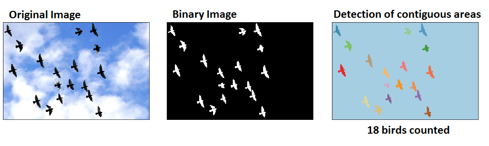
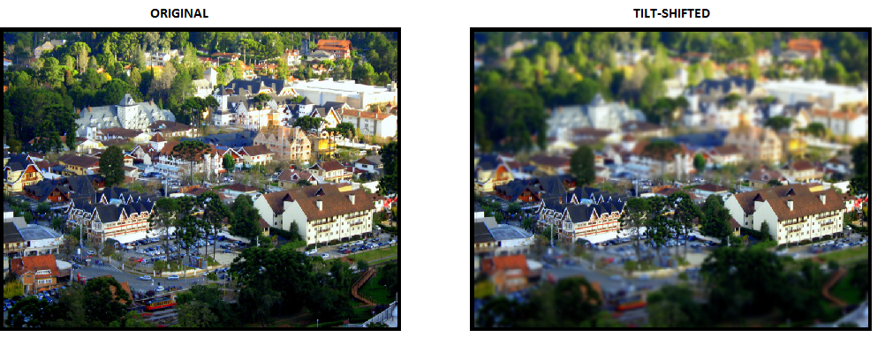

Image processing
============
Image processing is a very useful field of study. Used in all sorts of applications, from OCR (reading characters in scans or license plates), facial recognition, product quality gates, security cameras and many others.

Morphological Operations
--------

[Morphological](https://en.wikipedia.org/wiki/Mathematical_morphology) operations are image modification strategies where boolean decisions dictate which portions of an image should be affected by given operations.

**Bird counting**

In this example, I take an image of some birds flying in the sky, get the binary representation of that image (using a threshold color value), and count the contiguous areas, which gives us the number of birds.

**Tilt shift**

I challenged myself to create the [Tilt Shift](https://en.wikipedia.org/wiki/Tilt%E2%80%93shift_photography) effect from scratch (using nothing but morphological operations of scipy) without searching it up. This notebook contains the result.
